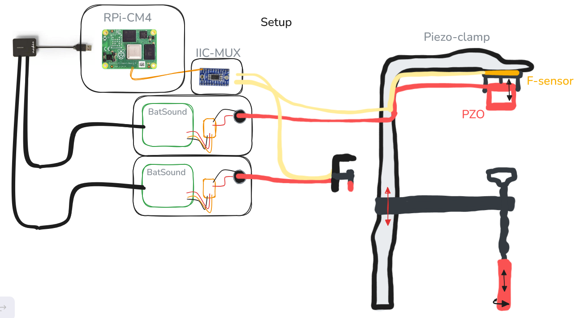

# plensetechdoc-passiveaudiocapture
Passive audio capturing of ultrasound using (hacked) Batsound sensors.

> ⚠️ **Notice**
>
> This is an *unfinished project documentation*.  
> **Plense Technologies** is no longer available for any comments or support.  
> You can use the **Discussions** page if you have questions.


---


## Introduction

---

This is a documentation of the passive audio capture setup where we use 6 batsounds with metal-piezo elements to listen to ultrasound insect noise. In this setup we have used the batsound sound interface and stream 2 of these on a Raspberry Pi (pi:streamer). Over the network, we can control multiple pi:streamer elements. This enables us to monitor and fetch mutlple piezo elements via one master/main device.

## Glossary

---

## Overall System

---

The system is configured from the following Bill-Of-Materials:

- 6x Batsound adc sound interface
    - (hardware adapted to allow for piezo elements to be connected through bnc
- 6x Piezo clamp
    - Glue-clamp with custom connector
    - Force sensor
    - Piezo element (PZO)
        - 4x Metal Piezo small (narrow-band) (vallen systems)
        - 2x Metal Piezo long (broad-band) (vallen systems)
- 3x Raspberry Pi CM4 (pi:streamer)
    - With IIC-MUX
- 1x Ethernet Switch or Router
- 1x Controller PC or Controller PI
    - With storage medium (SSD)

The general system consists of three pi:streamer modules with each controlling two piezo interfaces. One subsystem is built as follows



three of these systems are set up to control 6 piezo-clamps:


## WINDOWS / CONTROLLER SIDE

On the controller side, a PC (or RPi) is used to control the sequences. The PC communicates and controls the sequence of capturiong over the TCP protocol. The SCP protocol (SFTP) is then used to fetch the remote audio files and save them on the controller side (on a possible ssd).

The code for this side is found on the repository in **`windows_passive_audio_capture_netowork`**. Here the code structure works as shown below.


The toplevel controller handles all overhead and manages the sequence; from here you call a run or sequence (1 repetition sequence is a run).

```
if __name__ == "__main__":
    config = json.load(open(os.path.join(os.path.dirname(__file__), 'config.json')))
    controller = WindowsPACController(config, demo_mode=True)
    controller.run_sequence(runtime=10.0, repetitions=2, calibrate=False)
```

*It takes its input from the config file.* 

### CONFIG

```json
{
    "username": "plense",
    "password": "Plantenn@2022",
    "audio_file_prefix": "audio_",
    "local_storage_path": "C:\\Users\\StijnSlebos\\Downloads\\run4_scp",
    "remote_storage_path": "/home/plense/passive_sensor_data/fetch_test",
    "rpi_nodes": [  
        {
            "name": "plensepi00025",
            "ip_address": "192.168.0.87", 
            "port": 5000
        },
        {
            "name": "plensepi00029",
            "ip_address": "192.168.0.225", 
            "port": 5001
        },
        {
            "name": "plensepi00030",
            "ip_address": "192.168.0.40",
            "port": 5000
        }
    ],
    "rpi_demo_node": {
        "name": "plensepi00029",
        "ip_address": "192.168.0.225", 
        "port": 5001
    }
}

```

> If demo mode is on, the code will run for the single node defined in the demo-node config.

the Scheduler class manages the scheduling of the audio captures and uses the tcp nodes to control via a handshake.

the file handler class uses the tcp node to get the new files and uses the scp node to download the file and delete the remote file. it reads from a queue at the controller level

the tcp node is the RPI tcp interface class. For every pi:streamer in the system, an instance is initialized.

the scp node is the RPI scp interface class. there are also multiple instances of this class for every pi:streamer

## RPI STREAMER SIDE

The streamer side works in a similar fashion but is dependent on incoming commands over the tcp port (5001). In the repository, this code runs from the `passive_audio_capture` folder. This code is build to give the least amount of lag for the streaming side, to prevent buffer overflows when streaming 2 piezo-batsound setups. Since these stream at 256kHz/16bit, there is a lot of data passing through.

this setup looks as follows:


In this the Controller manages the communication

the file manager indexes the files and returns lists of new files

The capture manager is the interface that is built to efficiently stream both batsounds through a series of threads

The capture class is the basic stripped down element that interfaces an audio capture device, in this case the batsound adc.

[Running as a service](assets/running_as_a_service.md)

## **Using the setup in Office**

You can currently use the setup in the office by logging in remotely on a pi via raspberry pi connect.


here you can use the following commands in shell to get measuring:

navigate to:

```bash
>> cd contact-edge-code/contact-edge-code
```

activate venv

```bash
>> source /venv/bin/activate
```

edit the controller to your liked settings:

```bash
(venv)>> nano windows_passive_audio_capture_network/windows_pac_controller.py
```

edit the (sub)last line:

```python
    controller.run_sequence(runtime=10.0, repetitions=2, calibrate=False)
```

save `ctrl+O` , `enter` and exit `ctrl+X`

and run the file:

```bash
(venv)>> python windows_passive_audio_capture_network/windows_pac_controller.py
```

**in practice trials**
<p float="left">
  
  
  
  
</p>


### Next steps / To Do’s

- [ ]  Test possibility to run entirely off switch instead of router. OR, via an offline router
    - [ ]  Switch does not do routing naturally, but a laptop potentially can
    - [ ]  othherwise we do not have ip adresses

## Other documentation

---

links to related pages:
